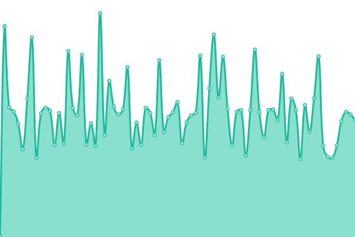

# [📈 Live Status](https://solutions2az.github.io/2az-status): <!--live status--> **🟩 All systems operational**

This repository contains the open-source uptime monitor and status page for [Solutions2AZ](https://www.solutions2az.net), powered by [Upptime](https://github.com/upptime/upptime).

With [Upptime](https://upptime.js.org), you can get your own unlimited and free uptime monitor and status page, powered entirely by a GitHub repository. We use [Issues](https://github.com/solutions2az/2az-status/issues) as incident reports, [Actions](https://github.com/solutions2az/2az-status/actions) as uptime monitors, and [Pages](https://solutions2az.github.io/2az-status) for the status page.

<!--start: status pages-->
<!-- This summary is generated by Upptime (https://github.com/upptime/upptime) -->
<!-- Do not edit this manually, your changes will be overwritten -->
<!-- prettier-ignore -->
| URL | Status | History | Response Time | Uptime |
| --- | ------ | ------- | ------------- | ------ |
|  [ConectandoCuba](https://www.conectandocuba.com) | 🟩 Up | [conectando-cuba.yml](https://github.com/Solutions2AZ/2az-status/commits/HEAD/history/conectando-cuba.yml) | 

 733ms
     
 | 

<a href="https://solutions2az.github.io/2az-status/history/conectando-cuba">100.00%</a>
    

|  [Solutions2AZ](https://www.solutions2az.net) | 🟩 Up | [solutions2-az.yml](https://github.com/Solutions2AZ/2az-status/commits/HEAD/history/solutions2-az.yml) | 

 614ms
     
 | 

<a href="https://solutions2az.github.io/2az-status/history/solutions2-az">100.00%</a>
    

|  [Solutions2AZ-es](http://www.solutions2az.es) | 🟩 Up | [solutions2-az-es.yml](https://github.com/Solutions2AZ/2az-status/commits/HEAD/history/solutions2-az-es.yml) | 

 943ms
     
 | 

<a href="https://solutions2az.github.io/2az-status/history/solutions2-az-es">100.00%</a>
    

|  [Solutions2AZ CallCenter](https://callcenter.solutions2az.net) | 🟩 Up | [solutions2-az-call-center.yml](https://github.com/Solutions2AZ/2az-status/commits/HEAD/history/solutions2-az-call-center.yml) | 

 885ms
     
 | 

<a href="https://solutions2az.github.io/2az-status/history/solutions2-az-call-center">100.00%</a>
    

|  [Solutions2AZ PBX](https://pbx.solutions2az.net) | 🟩 Up | [solutions2-az-pbx.yml](https://github.com/Solutions2AZ/2az-status/commits/HEAD/history/solutions2-az-pbx.yml) | 

 870ms
     
 | 

<a href="https://solutions2az.github.io/2az-status/history/solutions2-az-pbx">100.00%</a>
    

|  [Call2AZ - Manager](https://manager.call2az.net) | 🟩 Up | [call2-az-manager.yml](https://github.com/Solutions2AZ/2az-status/commits/HEAD/history/call2-az-manager.yml) | 

 675ms
     
 | 

<a href="https://solutions2az.github.io/2az-status/history/call2-az-manager">100.00%</a>
    

|  [Call2AZ - API](https://manager-api.call2az.net/api/Info/VersionString) | 🟩 Up | [call2-az-api.yml](https://github.com/Solutions2AZ/2az-status/commits/HEAD/history/call2-az-api.yml) | 

 499ms
     
 | 

<a href="https://solutions2az.github.io/2az-status/history/call2-az-api">100.00%</a>
    

|  [Call2AZ - Checkout](https://checkout.solutions2az.net/api/Info/VersionString) | 🟩 Up | [call2-az-checkout.yml](https://github.com/Solutions2AZ/2az-status/commits/HEAD/history/call2-az-checkout.yml) | 

 471ms
     
 | 

<a href="https://solutions2az.github.io/2az-status/history/call2-az-checkout">100.00%</a>
    

|  [Intranet Polaris](https://intranet.polaris.es) | 🟩 Up | [intranet-polaris.yml](https://github.com/Solutions2AZ/2az-status/commits/HEAD/history/intranet-polaris.yml) | 

 742ms
     
 | 

<a href="https://solutions2az.github.io/2az-status/history/intranet-polaris">100.00%</a>
    

|  [Intranet Armanext](https://intranet.armanext.com) | 🟩 Up | [intranet-armanext.yml](https://github.com/Solutions2AZ/2az-status/commits/HEAD/history/intranet-armanext.yml) | 

 596ms
     
 | 

<a href="https://solutions2az.github.io/2az-status/history/intranet-armanext">100.00%</a>
    

<!--end: status pages-->

[**Visit our status website →**](https://solutions2az.github.io/2az-status)

## 📄 License

- Powered by: [Upptime](https://github.com/upptime/upptime)
- Code: [MIT](./LICENSE) © [Anand Chowdhary](https://anandchowdhary.com), supported by [Pabio](https://pabio.com)
- Data in the `./history` directory: [Open Database License](https://opendatacommons.org/licenses/odbl/1-0/)
